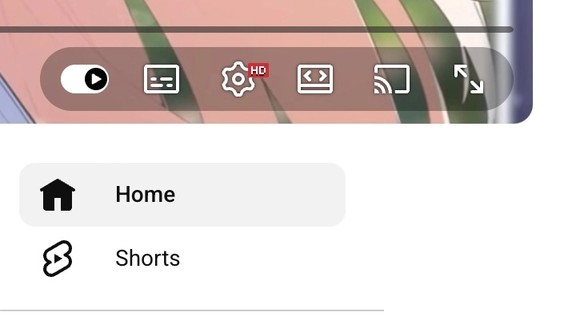
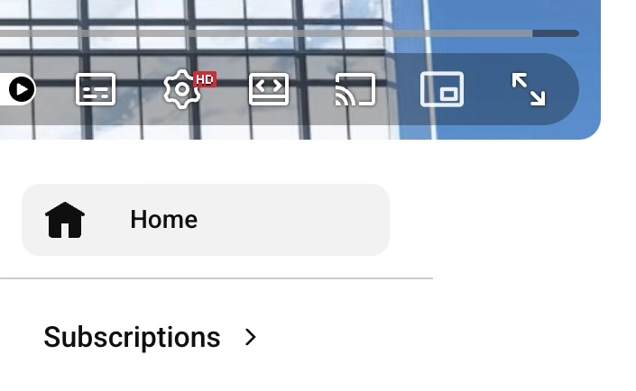

# yt-tools

[日本語](./README.ja.md)

YouTubeのミニプレーヤーボタンを復活させ、オプションでショート動画やPlayables（ミニゲーム）をブロックするChrome拡張機能です。

[プライバシーポリシー](./PRIVACY.md)

## 主な機能

- ミニプレーヤーボタンの復活
- オプションでショート動画を非表示にし、通常のプレーヤーで開く機能
- オプションでYouTube Playablesを非表示にし、ミニゲームページのリダイレクトを行う機能
- 拡張機能のポップアップから機能ごとにオン/オフを切り替え可能
- 英語と日本語のUIに対応
- データの収集や追跡なし

> [!WARNING]
> ショート動画とPlayablesのブロック機能は、デフォルトでは無効になっています。

## スクリーンショット

### Before



### After



## インストール方法

1. このリポジトリをクローンまたはダウンロードします。

```bash
git clone https://github.com/fjt-dev/yt-tools
```

2. `chrome://extensions/` を開きます。
3. **デベロッパー モード**を有効にします。
4. **パッケージ化されていない拡張機能を読み込む**をクリックし、プロジェクトフォルダを選択します。

---

**注意:** この拡張機能は、YouTubeおよびGoogleの公式製品ではなく、それらとの提携や承認を受けているものでもありません。
